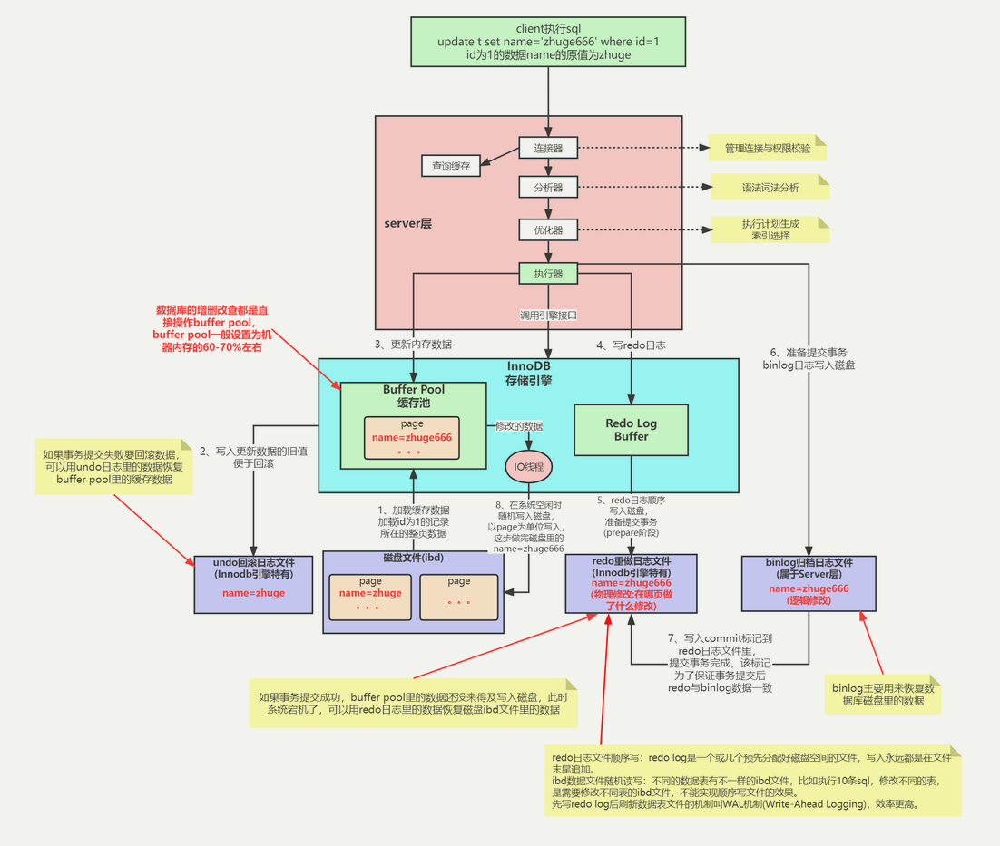

## 1，事务

### 1，ACID

```
顺序来说是，事务的原子性，一致性，隔离性，持久性
其中，AID，即原子性，隔离性，持久性都是为了保证C，即一致性的实现
1,原子性：Atomicity,1，事物是一个原子操作单元，2，要么全部执行，要么全部不执行
原子操作单元主要是说，1，不被中断机制影响。2，不被线程调度机制影响的一个或一系列操作。重点：原子性由undo log日志来实现。
中断是协作机制，控制CPU发出原语操作，而线程调度是具体实施控制分配CPU的使用权
原子性常见情况，数据库系统崩溃重启时，数据库处于不一致的状态，必须执行一个crash
即在断电，系统崩溃，其他软硬件错误时，通过redo/undo日志来回溯，执行撤销操作。但原子性也不一定能保证一致性
2，一致性：Consistent,1，事务开始和结束，数据必须保持一致。2，相关规则必须应用于事务的修改，保持数据的完整性。重点：由其他三种特性和代码逻辑维持
其中，脏读，即读未提交，不符合一致性，即C要求。比如，人家出差旅费，还没开发票上报，但财务已经把这个实际金额打到公司数据库里了。且幻读，不可重复读都是一致性问题。
3，隔离性：Isolation,1，由数据库提供的独立隔离环境机制，不受外部并发操作影响。比如：烟草局吃三代，内部操作，外人很难影响到，而规则由内部制定。重点：由隔离级别，锁，MVCC机制实现
其中，并发事务影响中的脏写，脏读，不可重复读，幻读中，不可重复读和幻读不符合隔离性。
4，持久性：Durable,1，事务完成时，对数据的修改是永久性的。即使出现系统故障也能够保持。重点：持久性由redo log日志来实现。

```

### 2，多事务并发问题

```
本质是多个事务处理数据库数据时，并发执行引起的读写问题
1,脏写或更新丢失：1，最后的更新覆盖前面事务的更新。比如：财务不公开，第一个人说新人工资是8K，但是第二个人说是10K，导致后面人认为工资是10k。就是写-写问题，
2,脏读：1，一个事务更新未提交，该条记录的数据处于不一致状态，2，未加以控制，其他事务来读取该记录数据时，读到了未提交的数据。问题：如果，第一个事务继续修改，但后面事务，已经提交，则后面拿的数据是之前的，但结果已经更改了，不一致。就是写-读-写问题
3,不可重复读：同一个事务，相同语句，不同时刻，读结果不一致。读-读。这里、要区分，不可重读强调的是同一行数据不同，而出现多行数据时，视为幻读。比如：一个人上午两小时搬了1000块砖，下午两小时却搬了2000块砖。侧重一行，即同一行数据发生变化。即U，对应结果
4,幻读：1，A事务读到B事务提交的新增数据，读-写。读的数据行数变多了。比如：上午一个人搬砖，再看时变成两个人搬砖了。侧重多行，之前没有，突然多了。即C和I，D，对应结果集
```


### 3，解决问题-保证隔离性isolation

- 3.1 事务隔离机制

```
为了解决数据库读一致性问题，即脏读，幻读，不可重复读，提供的解决方案，一般不需要我们动
主要分四个级别，从上到下，级别越高，并发问题少，代价大，因为事务隔离本质是事务串行化，与并发矛盾，MySQL默认的事务隔离级别是可重复读，
查看当前数据库的事务隔离级别：show variables like 'tx_isolation';
设置事务隔离级别：set tx_isolation='REPEATABLE_READ';
```

| 隔离级别                  | 脏读   | 不可重复读 | 幻读   |
| ------------------------- | :----- | :--------- | :----- |
| 读未提交_read uncommitted | 可能   | 可能       | 可能   |
| 读已提交_read committed   | 不可能 | 可能       | 可能   |
| 可重复读_repeatable read  | 不可能 | 不可能     | 可能   |
| 可串行化_serializable     | 不可能 | 不可能     | 不可能 |


- 3.2 锁机制

```
锁是计算机操作系统中一种协调机制，负责协调进程或线程间访问资源，资源包括CPU，内存，IO，以及数据
发生锁冲突，是影响数据库性能的重要因素
```

锁分类：

```
从性能上，分为乐观锁和悲观锁
从对数据操作的粒度，分为表锁和行锁，其他还有页面锁，记录锁，间隙锁，临建锁
从对数据库操作的类型，分为读锁（S锁，shared）和写锁（X锁，exclusive）（都属于悲观锁），也叫共享锁和排他锁，还有意向锁。
-读锁，共享锁，S锁，针对同一份数据，多个读，同时进行，互不影响
-写锁，排他锁，X锁，写操作独占，阻断其他写和读，修改操作都加锁，查询用for update加写锁，比如：select * from T where id = 1 for update;
-意向锁，I锁，针对表锁的标识，分为IS，IX
-表锁，锁表，优点：开销小，加锁快，不会死锁，缺点：粒度大，锁冲突概率大，并发度最低，场景：用于整表数据迁移
-表锁基本操作：
加锁：lock table 表名 read(write),表2 read(...)
查锁：show open table;
解锁：ublock tables;
-行锁，锁一行数据，优点：粒度小，锁冲突低，并发度高，缺点：开销大，加锁慢
innodb事务，transaction，且支持行锁
-事务中，读锁会阻塞写，不阻塞读。写都阻塞
```

锁优化建议：

```
-数据检索通过索引来完成，避免无索引行锁升级为表锁
-合理设计索引，缩小锁的范围
-减少检索条件范围，避免间隙锁
-控制事务大小，减少锁资源和时间长度，涉及事务加锁的sql尽量放在事务最后执行
-低级别事务隔离
```


- 3.3 MVCC多版本并发控制隔离机制

```
MVCC(Multi-Version Concurrency Control)多版本并发控制就可以做到读写不阻塞且避免了类似脏读这样的问题，主要通过undo日志链来实现。(undo 日志版本链在不同事务隔离级别基于可见性算法实现）。
先确定隔离级别
select操作是快照读 (历史版本)
insert、update和delete是当前读 (当前版本)
read commit (读已提交)，语句级快照
repeatable read (可重复读)，事务级快照
序列化：本质是通过在select语句后面加了共享锁：lock in share mode;
-innodb：引入多版本之后，只有写写之间相互阻塞，其他三种操作都可以并行，这样大幅度提高了InnoDB的并发度。InnoDB是在undolog中实现的，通过undolog可以找回数据的历史版本。找回的数据历史版本可以提供给用户读(按照隔离级别的定义，有些读请求只能看到比较老的数据版本)，也可以在回滚的时候覆盖数据页上的数据
-当前读：就是它读取的是记录的最新版本，读取时还要保证其他并发事务不能修改当前记录，会对读取的记录进行加锁。比如：S锁和X锁，即共享锁和排他锁
-快照读：MVCC就是为了实现读-写冲突不加锁，而这个读指的就是快照读, 而非当前读，当前读实际上是一种加锁的操作，是悲观锁的实现，像不加锁的select操作就是快照读，即不加锁的非阻塞读；快照读的前提是隔离级别不是串行级别
-关系：需要MySQL提供具体的功能去实现它，而快照读就是MySQL为我们实现MVCC理想模型的其中一个具体非阻塞读功能。而相对而言，当前读就是悲观锁的具体功能实现
```

MVCC解决的问题：

```
数据库并发场景有三种，分别为：

    读-读：不存在任何问题，也不需要并发控制
    读-写：有线程安全问题，可能会造成事务隔离性问题，可能遇到脏读，幻读，不可重复读
    写-写：有线程安全问题，可能会存在更新丢失问题，比如第一类更新丢失，第二类更新丢失

备注：第1类丢失更新：事务A撤销时，把已经提交的事务B的更新数据覆盖了；第2类丢失更新：事务A覆盖事务B已经提交的数据，造成事务B所做的操作丢失
-解决问题：
多版本并发控制（MVCC）是一种用来解决读-写冲突的无锁并发控制，也就是为事务分配单向增长的时间戳，为每个修改保存一个版本，版本与事务时间戳关联，读操作只读该事务开始前的数据库的快照。 所以MVCC可以为数据库解决以下问题

    在并发读写数据库时，可以做到在读操作时不用阻塞写操作，写操作也不用阻塞读操作，提高了数据库并发读写的性能
    同时还可以解决脏读，幻读，不可重复读等事务隔离问题，但不能解决更新丢失问题
-总结：
两个组合：

    MVCC + 悲观锁
    MVCC解决读写冲突，悲观锁解决写写冲突
    MVCC + 乐观锁
    MVCC解决读写冲突，乐观锁解决写写冲突

这种组合的方式就可以最大程度的提高数据库并发性能，并解决读写冲突，和写写冲突导致的问题
```

MVCC实现原理：

```
-为了解决读写冲突，它的实现原理主要是依赖记录中的 3个隐式字段，undo日志 ，Read View 来实现的
-隐式字段：每行记录除了我们自定义的字段外，还有数据库隐式定义的DB_TRX_ID,DB_ROLL_PTR,DB_ROW_ID等字段
-undo log主要分为两种：

    insert undo log
    代表事务在insert新记录时产生的undo log, 只在事务回滚时需要，并且在事务提交后可以被立即丢弃
    update undo log
    事务在进行update或delete时产生的undo log; 不仅在事务回滚时需要，在快照读时也需要；所以不能随便删除，只有在快速读或事务回滚不涉及该日志时，对应的日志才会被purge线程统一清除
-Read View，说白了Read View就是事务进行快照读操作的时候生产的读视图(Read View)，在该事务执行的快照读的那一刻，会生成数据库系统当前的一个快照，记录并维护系统当前活跃事务的ID(当每个事务开启时，都会被分配一个ID, 这个ID是递增的，所以最新的事务，ID值越大)
-整体流程：https://www.cnblogs.com/xuwc/p/13873611.html
```


-SQL执行流程：



## 2、MySQL底层实现

- B树


## 3，MySQL原生

### 1，数据类型

```
1、什么是存储引擎？
	存储引擎就是表的类型

2、查看MySQL支持的存储引擎
	show engines;
		
3、指定表类型/存储引擎
	create table t1(id int)engine=innodb;
	create table t2(id int)engine=memory;
---4、文本字符串类型
	总体上分为CHAR 、VARCHAR 、TINYTEXT 、TEXT 、MEDIUMTEXT 、LONGTEXT 、 ENUM 、 SET，blob
-重要：MySQL5.0版本以上，varchar(20)：指的是20字符，即字符个数
	char:定长，所占的存储空间的字节数就是声明的字段长度，范围是 0～255 个字符
	varchar:变长，占用的实际存储空间为字符串实际长度加1个字节，省空间，范围是 0～65535
	text:表示长度为 65535字符的 TEXT 列，TEXT 列保存非二进制字符串，如文章内容、评论等。当保存或查询 TEXT 列的值时，和上述两个区别是：不删除尾部空格
	enum:枚举类型，放多个指定选择的对象，选一个
	set:集合类型，放多个可选择对象，可选多个
-比如：
create table consumer(
	id int,
	name char(16),
	sex enum('male','female','other'),
	level enum('vip1','vip2','vip3'),
	hobbies set('play','music','read','run')
);


insert into consumer values
(1,'egon','male','vip2','music,read');

insert into consumer values
(1,'egon','xxxxx','vip2','music,read');

---5、数值类型：int，float，decimal(定点数)
-int：存储需4个字节，范围-2^31~2^31-1，unsigned zerofill，有无符合，填充0配合使用
-float：存储需要4个字节，单精度，
-decimal：默认（10,0），10为总位数，0为小数点后位数，存储需要10+2，DECIMAL（5,2）的类型，表示该列取值范围是-999.99~999.99

---6、日期/时间类型：包括 YEAR、TIME、DATE、DATETIME 和 TIMESTAMP
	create table student(
	id int,
	name char(6),
	born_year year,
	birth_date date,
	class_time time,
	reg_time datetime
);

insert into student values
(1,'egon',now(),now(),now(),now());

insert into student values
(2,'alex',"1997","1997-12-12","12:12:12","2017-12-12 12:12:12");
7、二进制类型：包括 BIT、BINARY、VARBINARY、BLOB
	
```

### 2，语法

- 数据库语言

```
数据库四大语言：

1、DDL （数据定义语言）
用来定义数据库的对象，如数据表、视图、索引等。

create drop alter truncate。

2、DML （数据操纵语言）
在数据库表中更新，增加和删除记录。如 update， insert， delete 不包含查询。

3、DCL （数据控制语言）
指用于设置用户权限和控制事务语句。如grant，revoke，if…else，while，begin transaction。rollback,commit

4、DQL （数据查询语言）
数据查询语言DQL基本结构是由SELECT子句，FROM子句，WHERE
```


- SQL基本语句

```
SQL语句：库-表-记录\增查改删、即CRUD。增加(Create)、检索(Retrieve)、更新(Update)和删除(Delete)，主要围绕库，表，数据的操作

操作文件夹（库）
	增
		create database db1 charset utf8;
	查
		show create database db1;
		show databases;
	改
		alter database db1 charset gbk;
	删
		drop database db1;

操作文件（表）
	切换文件夹：use db1;
	查看当前所在文件夹：select database();
	
	增
		create table t1(id int,name char);
	查
		show create table t1;
		show tables;
		desc t1;
	改
		alter table t1 modify name char(6);
		alter table t1 change name NAME char(7);
	删
		drop table t1;

操作文件内容（记录）
	增
		insert t1(id,name) values(1,'egon1'),(2,'egon2'),(3,'egon3');
	查
		select id,name from db1.t1;
		select * from db1.t1;
	改
		update db1.t1 set name='SB';
		update db1.t1 set name='ALEX' where id=2;
	删
		delete from t1;
		delete from t1 where id=2;
		truncate t1;
```

- 建表约束条件

```
-约束条件：约束条件是在数据类型的基础上，再对字段进行附加的一种限制
-约束条件有哪些：null，key，default，extra，用原生desc 表名、会显示字段名、类型以及后面四个约束条件
-其中，null和default可以用来限制不为空和默认值，通常是not null，default不输入，也会自动给一个值
-key可选项：
	1,unique key，键值唯一，分单列唯一和联合唯一。唯一写操作不可重复
	单列唯一：设置可直接在字段类型后加，也可以单独设置，unique（id）
	联合唯一：单独不唯一，几个字段合起来唯一，比如ip+port；192.168.0.1:8000这样的就是需要联合唯一，ip不唯一，port不唯一，合起来需要唯一,设置用unique(ip,port)
	
	2，primary key，主键，从约束上看是不为空且唯一，即not null unique
	对于innodb存储引擎来说，一张表内必须有一个主键，未指定时，innodb会扫描整表字段找到不为空且唯一的字段当做主键，没有则创建一个隐藏的字段，分为单列主键和符合主键
	单列主键：字段类型后加,primary key
	复合主键：primary key（id,name）,意义和联合唯一一样，在一起才是主键唯一
	
	3，auto_increment,自增，只能自定义一个自增，且必须定义为key，插入时，可直接插入其他的，不用管自增的，意味着不用传值，非得给其传值，也可以，自定义传值时，下面继续插入值时会按当前最后一个值，继续自增长，默认为1开始，每次增长为1，即步长为1，但也可以自己设置
	查看变量：show variables like 'auto_inc%';%表示任意字符
	步长变量：auto_increment_increment默认为1
	起始值：auto_increment_offset默认为1
	设置用set
	session为会话级别，只针对当前会话，关闭即失效
	global为全局变量设置后需要重启生效
	起始值需要小于等于步长，只是了解，很少会用到

	4，foreign key，外键，建立表之间关系，原生建表设置如下
	foreign key (字段) references dep(字段)
	但是需要先创建被关联的表,dep.后，再建立需要关联的表，建立关联之前需要知道，被关联的字段需要是唯一的，设置主键即可
	数据同步：删除和修改被关联字段，则所有建立外键关联的表同时修改，在外键后面加on delete cascade,删除同步 on update cascade，更新同步
	两张表被耦合了，可以从逻辑上耦合，而不是直接用外键强耦合在一起，以后再扩展时容易出问题，但Django框架会直接建立这个外键关系
```

- 表关系

```
-多对一，两张表之间的关系，比如出版社和书，书多对一出版社，通过建立外键
-多对多，作者和书，单独创建一个表，用来存放两表关系
-一对一，客户和学生，由外键加unique实现
```


- 单表查询

```
数据操作
-直接插入：
1. 插入完整数据（顺序插入）
    语法一：
    INSERT INTO 表名(字段1,字段2,字段3…字段n) VALUES(值1,值2,值3…值n);

    语法二：
    INSERT INTO 表名 VALUES (值1,值2,值3…值n);

2. 指定字段插入数据
    语法：
    INSERT INTO 表名(字段1,字段2,字段3…) VALUES (值1,值2,值3…);

3. 插入多条记录
    语法：
    INSERT INTO 表名 VALUES
        (值1,值2,值3…值n),
        (值1,值2,值3…值n),
        (值1,值2,值3…值n);
        
4. 插入查询结果
    语法：
    INSERT INTO 表名(字段1,字段2,字段3…字段n) 
                    SELECT (字段1,字段2,字段3…字段n) FROM 表2
                    WHERE …;
-更新数据UPDATE
语法：
    UPDATE 表名 SET
        字段1=值1,
        字段2=值2,
        WHERE CONDITION;

示例：
    UPDATE mysql.user SET password=password(‘123’) 
        where user=’root’ and host=’localhost’;   
-删除数据DELETE
语法：
    DELETE FROM 表名 
        WHERE CONITION;

示例：
    DELETE FROM mysql.user 
        WHERE password=’’;

练习：
    更新MySQL root用户密码为mysql123
    删除除从本地登录的root用户以外的所有用户

-查询是重中之重，读多写少
```

- 单表查询语法

```
-语法顺序
SELECT distinct（去重） 字段1,字段2... FROM 表名
                  WHERE 条件
                  GROUP BY field 分组
                  HAVING 筛选《过滤
                  ORDER BY field 排序
                  LIMIT 限制条数
查什么，从什么地方查，范围缩小，
对于查什么的结果，可以去重，四则运算，起别名（as 别名，as可不加），concat（'姓名：'，name）拼接字符串
- 关键字的执行优先级(重点)
重点中的重点：关键字的执行优先级
from		1.找到表:from
where		2.拿着where指定的约束条件，去文件/表中取出一条条记录
group by	3.将取出的一条条记录进行分组group by，如果没有，则整体作为一组
having		4.将分组的结果进行having过滤
select		5.执行select
distinct	6.去重
order by	7.将结果按条件排序：order by
limit		8.限制结果的显示条数
-执行顺序伪代码
def from(db,table):
	f = open(r'%s\%s'%(db,table))
	return f

def where(condition, f):
	for line in f:
		if condition:
			yield line# 不停的返回
def group(lines):
	pass
def having(group_res):
	pass
def distinct(having_res):
	pass
def order(distinct_res):
	res
def limit(order_res):
	pass
def select():
	f = from()
	lines = where()
	group_res = group(lines)
	having_res = having(group_res)
	distinct_res = distinct(having_res)
	order_res = order(distinct_res)
	res = limit(order_res)
	print(res)
return res

-WHERE约束

where字句中可以使用：

1. 比较运算符：> < >= <= <> !=
2. between 80 and 100 值在10到20之间
3. in(80,90,100) 值是10或20或30
4. like 'egon%'
    pattern可以是%或_，
    %表示任意多字符
    _表示一个字符
5. 逻辑运算符：在多个条件直接可以使用逻辑运算符 and or not 
-group by分组，分组后可以用聚合函数
分组目的，是以一组为单位，按照某个相同的字段进行归类
取得每个表的情况，用于分析
当分组无where条件时，只有分组字段的第一条记录
mysql>setglobalsql_mode='ONLY_FULL_GROUP_BY';
只能查
-聚合函数


#强调：聚合函数聚合的是组的内容，若是没有分组，则默认一组

示例：
    SELECT COUNT(*) FROM employee;
    SELECT COUNT(*) FROM employee WHERE depart_id=1;
    SELECT MAX(salary) FROM employee;
    SELECT MIN(salary) FROM employee;
    SELECT AVG(salary) FROM employee;
    SELECT SUM(salary) FROM employee;
    SELECT SUM(salary) FROM employee WHERE depart_id=3;
-HAVING过滤

HAVING与WHERE不一样的地方在于!!!!!!

#！！！执行优先级从高到低：where > group by > having 
#1. Where 发生在分组group by之前，因而Where中可以有任意字段，但是绝对不能使用聚合函数。

#2. Having发生在分组group by之后，因而Having中可以使用分组的字段，无法直接取到其他字段,可以使用聚合函数

-查询排序:ORDER BY
表默认按ID升序排序，即ID从小到大排序
asc升序，从小到大,默认就是升序可不写
desc降序，从大到小


按单列排序
    SELECT * FROM employee ORDER BY salary;
    SELECT * FROM employee ORDER BY salary ASC;
    SELECT * FROM employee ORDER BY salary DESC;

按多列排序:先按照age排序，如果年纪相同，则按照薪资排序
    SELECT * from employee
        ORDER BY age,
        salary DESC;
-limit最后
取最高工资的详细信息
limit 0,5；
从第0条开始取，往后取5条记录

-补充：模糊查询like
%:多个字符
_:单个字符，多个就用多个下划线
模糊匹配：正则表达式
regexp'^jin'

```


- 多表连表查询

```
多表查询
笛卡尔积，一一全部关联一遍
在此基础上可以进行where筛选，不建议这么做，
MySQL提供了专门的操作
-三种连表方式：
1，内连接：只取两张表共同部分
表1 inner join 表2 on 条件
2，左连接：在内连接的基础上，保留左表，即便
左表和右边无任何对应关系，任然保留
表1 left join 表2 on 条件

3，右连接：
在内连接的基础上，保留右表，即便
左表和右边无任何对应关系，任然保留
表1 right join 表2 on 条件

4，全外连接：
在内连接的基础上，保留左右两表，即便
左表和右边无任何对应关系，任然保留
表1 left join 表2 on 条件
union
表1 right join 表2 on 条件
MySQL不支持full join，可以左右分别连接后，
去重再合并

select完整语法
SELECT DISTINCT <select_list>
FROM <left_table>
<join_type> JOIN <right_table>
ON <join_condition>
WHERE <where_condition>
GROUP BY <group_by_list>
HAVING <having_condition>
ORDER BY <order_by_condition>
LIMIT <limit_number>

select执行顺序
1，执行from语句，找到两张表，做笛卡尔积
2，执行on过滤
3，添加外部行，连接join
4，where
5，group
6，having
7，select
8，distinct
9，order 
10，limit

子查询
#1：子查询是将一个查询语句嵌套在另一个查询语句中。
#2：内层查询语句的查询结果，可以为外层查询语句提供查询条件。
#3：子查询中可以包含：IN、NOT IN、ANY、ALL、EXISTS 和 NOT EXISTS等关键字
#4：还可以包含比较运算符：= 、 !=、> 、<等

带in,not in
带比较运算符
带exists，判断子查询是否有结果，TRUE或者FALSE
where EXISTS（子查询）；
```


- 索引及优化
- explain分析

## 4，Django的orm


## 5，Django的DRF使用

