# Django之Django-restframework，DRF组件使用

## 1，目标定位

- 了解web应用基础
- 了解RESTful API 规范
- 编写CBV(FBV)，DRF接口
- 理解序列化器
- 视图逻辑函数
- 了解路由
- 其他组件使用

## 2，概况内容

```
Django-restframework是一个基于Django框架的RESTful API开发工具，它提供了一系列的功能和工具，使得开发者能够快速地构建出高质量的API。在企业级开发中，Django-restframework已经成为了一个非常重要的工具，以下是它在企业级开发中的应用：

1. 快速开发API：Django-restframework提供了一系列的工具和功能，使得开发者能够快速地构建出高质量的API。这对于企业级开发来说非常重要，因为它能够大大缩短开发周期，提高开发效率。

2. 灵活的序列化与反序列化：Django-restframework提供了灵活的序列化与反序列化功能，使得开发者能够轻松地将数据转换成JSON或其他格式。这对于企业级开发来说非常重要，因为它能够方便地处理数据的传输和存储。

3. 认证和授权：Django-restframework提供了多种认证和授权机制，使得开发者能够轻松地为API添加认证和授权功能。这对于企业级开发来说非常重要，因为它能够确保API的安全性和可靠性。

4. 视图和路由：Django-restframework提供了多种视图和路由机制，使得开发者能够轻松地为API添加不同的视图和路由。这对于企业级开发来说非常重要，因为它能够满足不同的业务需求。

5. 文档和测试：Django-restframework提供了文档和测试工具，使得开发者能够轻松地为API添加文档和测试。这对于企业级开发来说非常重要，因为它能够确保API的质量和可靠性。

总之，Django-restframework在企业级开发中的应用非常广泛，它能够提高开发效率，确保API的安全性和可靠性，满足不同的业务需求，是一个非常重要的工具。
```

## 3，详细

### 3.1 web应用基础

- 在web开发应用中，有两种模式，前后端不分离，前后端分离
- 前后端不分离，前端看到的所有内容和界面都是由服务端提供出来的，比如Django自带的MVT模式
- 前后端分离，例：Vue+Django+Nginx，把前端页面放在Nginx服务器中，后端只关心接口设计，

针对数据库中数据操作，前端通过Ajax请求请求数据，对后端传来的数据，进行js渲染等，可以做到职责分离。

- API接口：应用程序编程接口
  - 就是程序对外提供**操作**数据的**入口**
  - 入口可以是函数，也可以是一个**地址URL**，工作中常见的是，我们调用其他人或公司组织编写的API
  - 市面上大部分人用的接口实现规范是：restful，RPC

### 3.2 RESTful API 规范

- restful：中文翻译，**资源状态转换**
- 重点：把服务端所有的**数据/文件**都看成资源
- 所以，API接口请求数据的操作，也是对资源的操作
- restful要求，**资源名称**写在URL地址中，通过**http请求动词**说明是对资源具体的操作
- 注：幂等性，客户端多次同样请求时，对服务端资源产生影响。
  - 其中，结果一样，属于幂等接口，增删改查查五个接口，除post是非幂等接口外，其余都是幂等的
  - 但五个接口中，除GET外，其他四个理论上都不安全

### 3.3 编写CBV(FBV)，APIview接口

1. FBV 方式，伪代码简单测试

- 在创建的app中，设置路由，URL

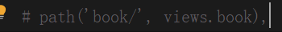

注：去掉注释

- 路由映射的book函数还没有，去视图views文件去创建它

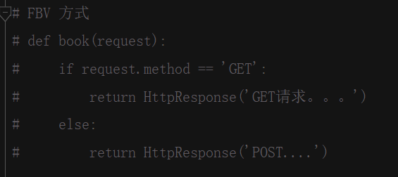

- 测试之前，先把Django自带中间件和组价注释掉，settings文件注释CSRF

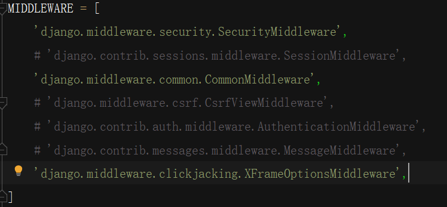

- 测试，我这里用的是postman，测试接口用swagger，eolink,apifox都行，看自己个人喜欢


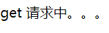

注：请求时注意，反斜杠问题，或者反应慢多点几次

2. CBV 方式 ，还是伪代码简单测试

- 改views文件，不用单个函数，而是把函数组织成一个类

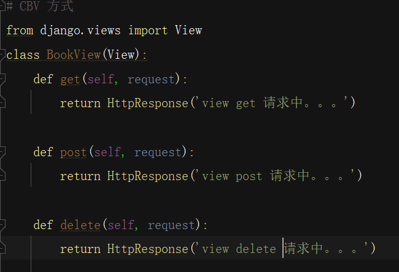

- 改路由，这里记得括号不能丢，自动补全不带括号

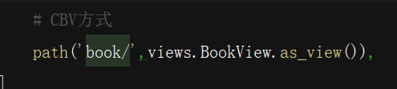

注：这里看到，前面引号内是资源，后面是匹配地址，get(self, request)
每个都有self和request形参，匹配到类的as_view()方法，后面再说

- 测试，看是否可以成功，成功即表示demo可用，CBV方式完成

GET请求：

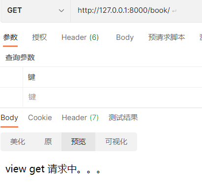

POST请求：

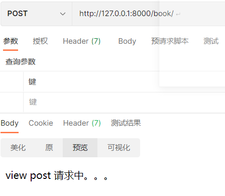

全部成功。我们到这里就已经实现CBV方式的接口demo

3. 面向对象及CBV解析
   	之前的Django的视图函数就是FBV，局限性，资源的相关操作是独立的 
   函数并没有被组织在一起，而Python是面向对象的，所以CBV更合适接口开发

- 面向对象-反射

```
Python3面向对象中反射的方法包括：

1. hasattr(obj, name)：判断对象obj是否包含名称为name的属性或方法，返回布尔值。

2. getattr(obj, name[, default])：获取对象obj中名称为name的属性或方法的值，如果属性或方法不存在，则返回default（默认为None）。

3. setattr(obj, name, value)：将对象obj的名称为name的属性或方法设置为value。

4. delattr(obj, name)：删除对象obj的名称为name的属性或方法。

5. dir([obj])：获取对象obj的所有属性和方法的列表，如果没有指定对象，则返回当前作用域中的所有名称。

6. issubclass(class, classinfo)：判断class是否为classinfo的子类，返回布尔值。

7. isinstance(obj, classinfo)：判断对象obj是否为classinfo的实例，返回布尔值。

8. type(obj)：获取对象obj的类型。

9. id(obj)：获取对象obj的唯一标识符。
```

- 面向对象-继承

```
在 Python 中，self 是一个特殊的参数，它代表了实例对象本身。在类中定义方法时，第一个参数必须是 self，用于接收实例对象。通过 self，我们可以访问实例对象的属性和方法。

在继承中，子类继承了父类的属性和方法，也可以通过 self 访问父类的属性和方法。在子类中，可以通过 super() 函数调用父类的方法，也可以直接使用父类的类名调用父类的方法。
```

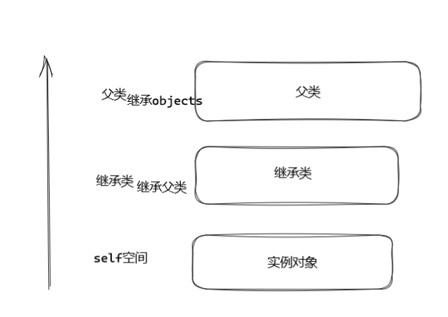

- 首先，通过子类实例化一个对象时，就是相当于开辟了一块空间，而self即指向这个空间，而传的参会存放到该空间中，当调用self.func()时，先在子类中找有无此方法，没有就往上去父类找，无就近原则

- 元类和基类

````
1. 元类

元类是用于创建类的类。在Python中，一切皆对象，类也是对象，因此类也可以使用元类来创建。元类可以控制类的创建过程，例如可以修改类的属性、方法等，还可以在类被创建时自动执行某些操作。

元类通常使用`type`类创建，例如下面的代码创建了一个名为`MyMeta`的元类：

```python
class MyMeta(type):
    pass
```
2. object类

`object`类是Python中所有类的基类，即所有类都是`object`类的子类。`object`类提供了一些基本的方法和属性，例如`__init__`、`__str__`、`__repr__`等，这些方法和属性可以被子类继承和重写。

例如，下面的代码定义了一个名为`MyClass`的类，该类继承了`object`类，并重写了`__str__`方法：

```python
class MyClass(object):
    def __str__(self):
        return "MyClass"
```
````

- Django-CBV解析

Django的CBV也是基于FBV的，上面CBV实现过程主要是几点要注意的

​		* as_view()是啥,我们打开代码看看

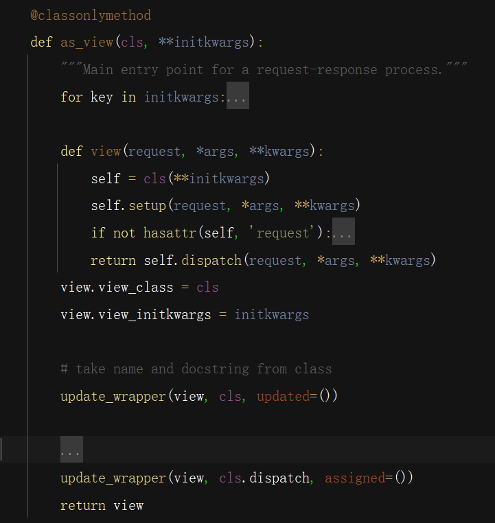

注：首先开头@classonlymethod装饰器，表示这是一个只能类调用的方法，之后形参里面有一个cls，谁调用的这个函数，这个cls就是谁，这里是bookview类，里面有一些捕获异常的都合并不看，只看，里面重要的东西，其后as_view,在其内部又定义了一个内部函数view，形成一个闭包，这个view函数参数是带request请求的，它一上来实例化了一个bookview类的对象self，最后return self.dipatch。而as_view函数最后return了一个view。

那我们就目前可以理解整个路由匹配过程是：这里的view是view类里的as_view函数中定义的闭包函数view()

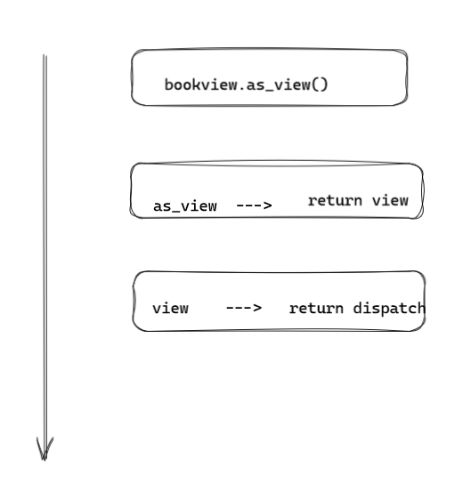

那self.dispatch又是什么逻辑呢？一步步来看看，首先是self.dispatch,self是bookview的一个实例化对象，优先去bookview类里去找这个函数，可想而知，我们根本就没写==，那没办法，只能去找bookview的父类，即view,这个view和as_view函数return的不是同一个，一个是类，一个是函数。果不其然在view类（该类路径在django/views/base.py文件里）里有dispatch函数

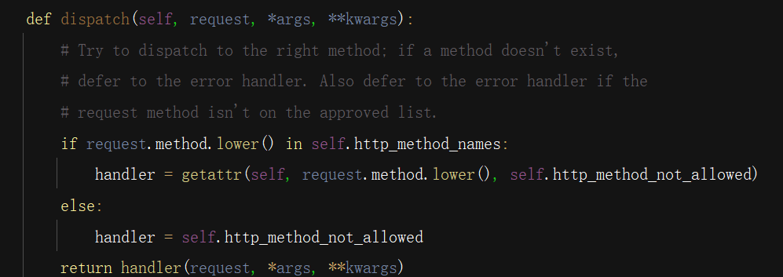

这个函数先用反射函数getattr，把as_view()函数里的内部函数view创建的bookview的实例化对象，以及其http请求的方法的小写字符串，返回了一个方法值传给了handler，最后return handler()执行该方法，同理反射后的到的方法，先去bookview找，有那就执行。拿get请求举例：

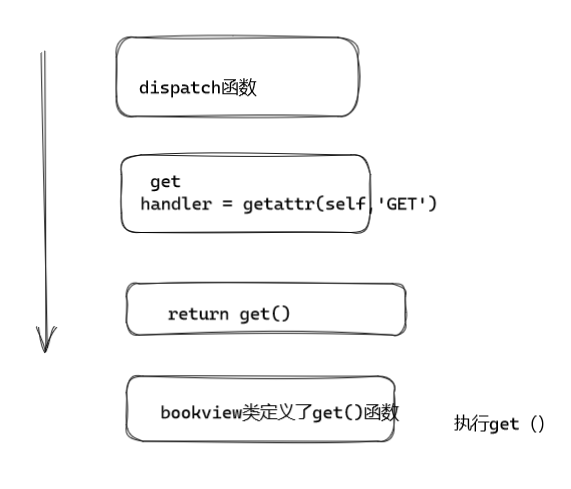

4. Django-Rest-Framework-APIView使用

- ```
  Django-Rest-Framework的APIView是一个基于Django的View，可以使用REST Framework的许多功能，如认证和权限。它提供了一些默认的方法，如get、post、put、delete等，可以方便的处理HTTP请求。同时，它也提供了一些灵活的方法，可以让我们处理一些自定义的请求。
  使用前，先安装DRF
  pip install djangorestframework -i hhtps://pypi.douban.com/simple
  ```

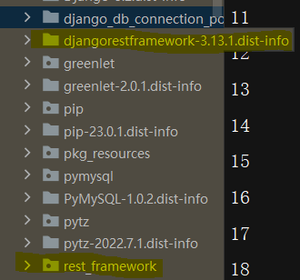

安装好后，会有一个版本配置的文件夹和DRF组件包，我们要用的都在rest_framework文件夹里

- 还是之前代码，基本不动，导入APIView,把bookview父类改为APIView即可

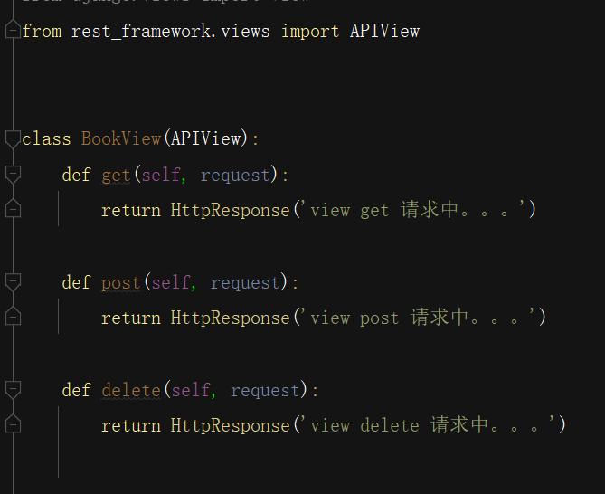

- APIView解析

``` 
APIView基于view类封装的，是DRF的基类，其中as_view在流程上基本没改变，调用超类方法，但是dispatch是重点
dispatch构建了新的request对象，提供了认证，权限，限流组件三剑客，分发
原生Django的request对象有局限性，基于wsgi的HTTPrequest对象，在post请求时，只能获取urlencoded,
即：请求体中，请求数据格式为：contentType:urlencoded \r\n\r\n a=1&b=2
不支持json格式，但转换过的request对象，不管前端发什么，后端都接收<querydict>字典对象
```


- 常用属性

``` 
request.data,请求体数据，类似于Django中标准的request.POST和request.FILES,包含了post,put/patch数据
request.query_params,与Django标准的request.GET相同
request._request，获取Django封装的原生request对象
```


### 3.4 理解序列化器

```
DRF的序列化器是一个重要的组件，它可以将Python对象序列化为JSON、XML等格式的数据，也可以将JSON、XML等格式的数据反序列化为Python对象。在DRF中，序列化器的主要作用是将数据转换为可供API使用的格式。

DRF的序列化器有两种类型：ModelSerializer和Serializer。ModelSerializer是一个基于模型类的序列化器，它可以自动根据模型类生成序列化器，而Serializer是一个通用的序列化器，需要手动定义序列化和反序列化的逻辑。

使用DRF的序列化器可以实现以下功能：

1. 模型序列化：将模型类对象序列化为JSON等格式的数据，并可以根据需要选择序列化哪些字段。

2. 模型反序列化：将JSON等格式的数据反序列化为模型类对象，并可以根据需要验证数据的合法性。

3. 嵌套序列化：将多个模型类对象序列化为JSON等格式的数据，并可以根据需要选择序列化哪些字段。

4. 嵌套反序列化：将JSON等格式的数据反序列化为多个模型类对象，并可以根据需要验证数据的合法性。

5. 自定义序列化：可以根据需要自定义序列化和反序列化的逻辑，实现更复杂的数据转换。

6. 序列化器验证：可以使用序列化器的验证功能，验证数据的合法性，并返回错误信息。

在使用DRF的序列化器时，需要注意以下几点：

1. 序列化器的字段必须与模型类的字段一一对应，否则会出现序列化或反序列化失败的情况。

2. 序列化器的验证功能可以确保数据的合法性，但需要手动调用is_valid()方法才能触发验证。

3. 序列化器可以嵌套使用，但需要注意避免循环引用的问题。

4. 序列化器可以自定义序列化和反序列化的逻辑，但需要注意保持代码的可读性和可维护性。
```

- 实际操作一下，依旧创建一个app，然后注册


- 设计表结构，写模型文件，创建表迁移文件

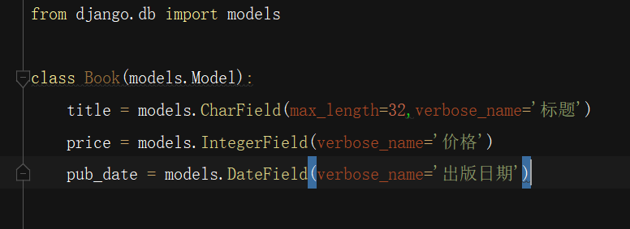

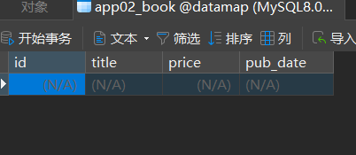

这个时候，表建好了，我们插点数据进去

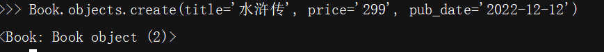

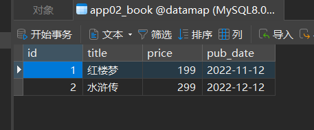

- 定义序列化器，针对模型字段设计

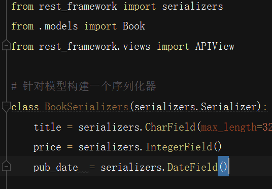

- 构建序列化器实例，测试

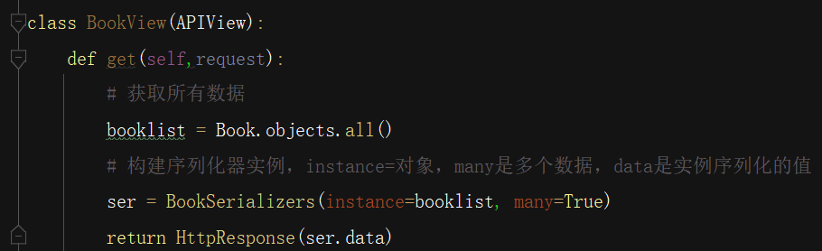

- 设置URL，测试

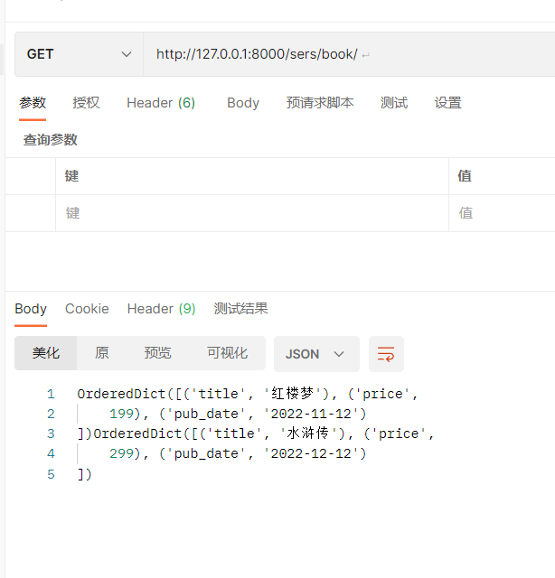

注：请求成功，但是这里返回的是一个有序字典OrderedDict,不是很直观的看到效果，没有json格式好，所以我们，换DRF自带的响应

- 更换响应，导包

```
from rest_framework.response import Response
return Response(ser.data)
```

- 测试

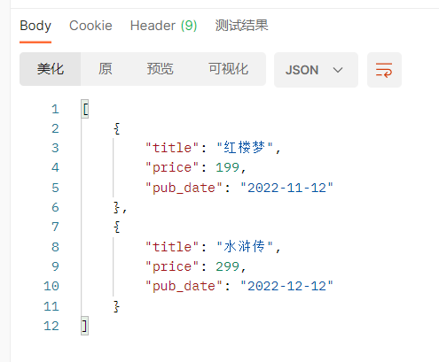

注：以JSON格式输出，明显结果清晰多了

- 那他怎么实现的呢

```
 # 序列化器
 class BookSerializers(serializers.Serializer):
    title = serializers.CharField(max_length=32, source='')
 booklist = Book.objects.all()
 # 构建序列化器实例，instance=对象，many是多个数据，data是实例序列化的值
 ser = BookSerializers(instance=booklist, many=True)
 return Response(ser.data)
 ####
 首先，获取数据实例化对象，当设置many这个参数时，表示有多个数据集合
 data = []  # 创建列表，里面包含多个字典，就是我们前端看到的结果
 for obj in instance:
 	d = {'title':"", 'price':"", ...}  # 按序列化器内对象来，
 	d['title'] = instance.title		# 这里实例化对象.调用的是booklist里的数据，默认用序列化器定的字段名，除非在序列化器里加souce=源对象名称
 	d['...'] = ...
 	data.append(d)  # 循环把每条数据插入data列表里
 return data   # 最后通过DRF自带的response返回前端
```

- 说一说restful规范

```
路由实例		HTTP请求			响应
/book/			GET				请求所有资源，返回所有
/book/			POST 			添加一个资源，返回一个
/book/1			GET 			请求单一资源，返回单一
/book/1			PUT 			修改单一资源，返回单一
/book/1			DELETE			删除单一资源，返回单一
```

- 了解了上面内容，我们来做POST请求，这里需要用到反序列化，以及一个数据和法校验问题

```
# 还是和get定义，定义方法，按要求返回一个资源
def post(self, request):		# self实例，和APIView新创建的request
	newbook = Bookserilizer(data=request.data)
	#反序列化
	# 数据合法校验
	if newbook.is_valid(self):
		Book.objects.create(**newbook.validated_data) # 参数用合法的数据，用**打散了
		return Response(request.data)
	else:
		return Response(newbook.errors)  # 错误，则输出'字段'：[异常错误信息]
	
```

- validated_data

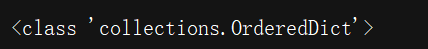

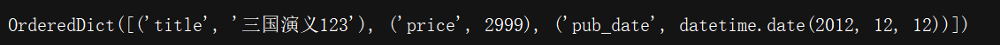

- 校验问题

```
# 校验时，需要和序列化器对象键匹配，相当于校验规则
title = serializers.CharField(max_length=32, required=False)
# 这里设置False，表示可以为空，但是我们设计表结构时，并没有设置字段可为空，所以传值依然报错
# 即在数据库层面，还有一层声明
# 后面可以把功能单独封装起来，后面做解耦
newbook.save()
# 这里执行save操作，而本身源码并没有写create，所以需要我们单独写一个，表示create功能可以很复杂
#并且需要我们return 返回值
```

总结：

```
1.目前为止，我们用到的crud接口设计组件为
urls：普通路由方式
settings：常见组件未用
models：常规原始模型+serializer模型序列化器
view：原始view --> APIView
可以发现上面的代码耦合度并不高，虽然模块独立性高，开发灵活性也高，但是不够方便
===========
2.接下来，我们把原始的serializer模型序列化器换成高级一点的modelserializer序列化器，提高了耦合度，强耦合，但是开发方便
# date = serializers.Datefield(source=pub_date)  # 切记起别名发往前端，或接受前端数据，需要对应meta里面fields,exclude的资源对象，不要少，否则报错，修改和增加不了数据
class Meta:
	model = book
	fields = '__all__'/exclude = 'date'
	
3.为了开发效率，我们进一步把视图类也换成genericAPIView
class Bookserializer(serializer.modelserializer):  # 序列化器不变
	class Meta:
		model = book
		fields = ['__all__']
class   BookView(GenericAPIView):
    queryset = Book.objects.all()  # 1,获取资源对象
    serializer_class = BookSerializers  # 2,获取序列化器类

    def get(self, request):
        book = self.get_serializer(instance=self.get_queryset(), many=True)
        return Response(book.data)

    def post(self, request):
        book = self.get_serializer(data=request.data)
        if book.is_valid():
            book.save()
            return Response(book.data)
        else:
            return Response(book.error)
class BookDetailView(GenericAPIView):
    queryset = Book.objects.all()  # 1,获取资源对象
    serializer_class = BookSerializers  # 2,获取序列化器类

    def get(self,request, pk):
        book = self.get_serializer(instance=self.get_object())
        return Response(book.data)

    def delete(self, request,pk):
        self.get_object().delete()
        return Response()

    def put(self, request, pk):
        book = self.get_serializer(instance=self.get_object(), data=request.data)
        if book.is_valid():
            book.save()
            return Response(book.data)
        else:
            return Response(book.error)

		
	
```

- 我们这里新建两张表用来进一步扩展封装接口，5个视图扩展类

``` 
class publish(models.Model):
	
```


### 3.5 视图逻辑函数

### 3.6 了解路由

### 3.7 其他组件使用

## 4，思考：待解决问题

### 4.1 CBV方式中，dispatch函数可以直接拿到bookview中来吗？

可以，直接复制过来，逻辑不变，只是分发是由bookview类的dispatch函数来分发，并且还可以用super()来调用view父类的dispatch，在此基础上，可以自己定制化个性内容需求，但是注意super()本身不返回对象，所以，需要return super()。