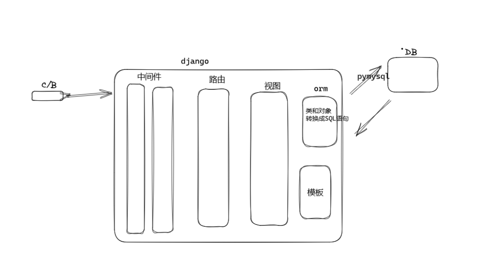
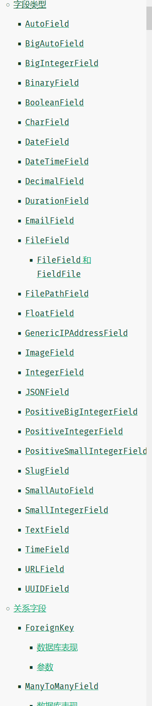
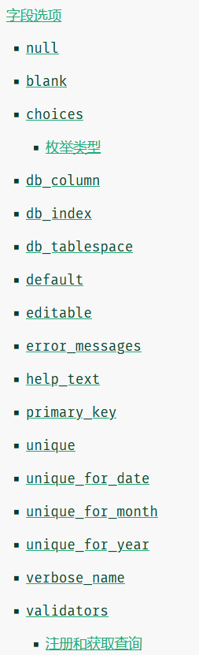
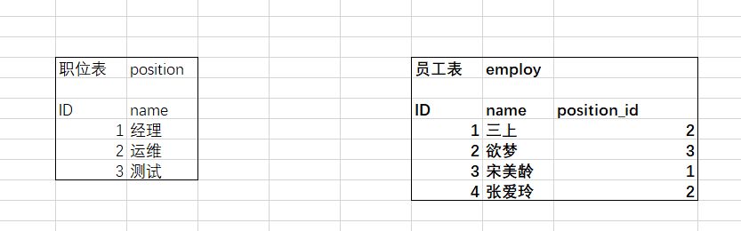
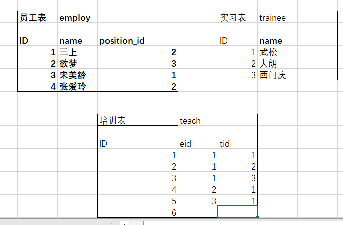
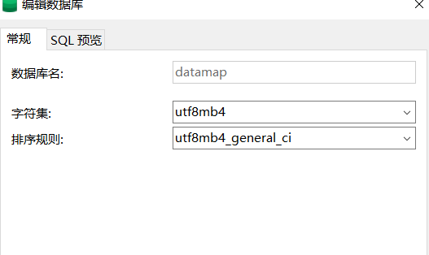

# Django-orm

## 1，目标定位

- 了解orm是什么
- 基本操作
- 连接数据库
- 表关系
- 数据操作

## 2，概况内容

- Django的orm本质上是一个翻译，通过对models文件中的类或对象，翻译成数据库语句，达到一个操作数据库的效果
- 大多框架没有自带的ORM，Django自带，
- Django的ORM生命周期



- Django的ORM操作，通过把对象和类，转换成SQL语句，然后对应数据库做处理生成和修改，

反过来操作数据库，获得数据后，再转换成类和对象给到Django

- 从技术上讲，这些方法都被定义在 [`django.db.models.fields`]，但为了方便，它们被导入到 [`django.db.models`]；标准的惯例是使用 `from django.db import models` 并利用 `models.<Foo>Field`。

备注：<FOO>是占位符

## 3，详细

### 3.1.1 表结构

- 这里的表结构指的是设计models文件里的对象或类
- 与数据库一一对应：ID默认自增创建，建议自己修改，不要默认

数据库：				类

表名					APP名+类名小写

字段或列名		类中实例的对象

字段类型			实例调用的方法

字段选项			方法的参数

一行或一条数据	类的实例


- 常见字段类型：参考Django文档



```python
# 创建models类
from django.db import models

class UserInfo(models.Model):
# 字段类型  
	name = models.CharField(max_length=16)
    age = IntergerField()


```

- 常见字段

```python
# 整型
SmallIntegerFiled
IntegerField
PositiveIntegerFiled
BigIntegerField
# 字符串
CharField
# 日期时间
DateField,DateTimeFiled
# bool
BooleanFiled
# 具体金额
DecimalFiled
```

- [字段类型详细](./orm字段类型.md)


- 字段选项：默认都可用的参数



- IntegerField常见参数

``` 
# 默认
age = IntergerField(verbose_name='年龄')
# 其余常用参数参考CharField
```


- CharField常见参数，max_length必须要，正常对应数据库中varchar

``` 
name = models.CharField(verbose_name='名字',max_lenth=16)
# 默认值
name = models.CharField(verbose_name='名字',max_lenth=16,default='')
可为空，一般搭配使用
name = models.CharField(verbose_name='名字',max_lenth=16,default='',blank=True)
# 唯一索引和索引
name = models.CharField(verbose_name='名字',max_lenth=16,unique=True)
name = models.CharField(verbose_name='名字',max_lenth=16,db_index=True)
# 元祖choices,数据库存储只能存sh,bj（上海北京用来页面上显示中文用的）
name = models.CharField(verbose_name='名字',max_lenth=16，choices=(('sh',上海'),('bj','北京')),default='sh')

```

- DateTime常见参数

``` 
# 默认
date = models.DateField(verbose_name='时间')
# 自动添加系统时间
date = models.DateField(verbose_name='时间'，auto_now=True)
```

- BooleanField常见参数:Boolean由0和1构造成的

``` 
# yes_or_no = models.BooleanField(verbose_name='对错')
```

- DecimalField精确的小数,浮点型存在误差问题

``` 
amount = models.DecimalField(verbose_name='金额',max_length=10,decimal_places=2)
```


### 3.1.2 表关系

表关系主要是：单表，一对多，多对多

- 在models文件中创建表类时，可在类的第一行写一个引号注释，用来写中文表名

```python
from django.db import models
class Girl(models.Model):
    '''女孩'''
    {
        name = model.CharField(max_length=8)
    }
```

- 一对多情况，这里用Excel表格和代码演示



一个职位对应多个员工，多删除某条或某行数据不影响单，单删除会影响多

``` 
from django.db import models
class Position(model.Model):
	name = models.CharField(verbose_name='职位', max_length=4)
class Employ(models.Model):
	name = models.CharField(verbose_name='员工',max_lenth=6),
# 级联删除，一对多，删除某条数据或某行，删除一则管理也删除
	position_id = models.ForeignKey(verbose_name='职位ID',to='Position',to_field='id',on_delete=models.CASCADE)
# 置空，且要先设置可为空
position_id = models.ForeignKey(verbose_name='职位ID',to='Position',to_field='id',on_delete=models.set_null,null=True,blank=True)
# 设置默认值
position_id = models.ForeignKey(verbose_name='职位ID',to='Position',to_field='id',on_delete=models.SET_DEFAULT=1)
	
```


- 多对多



- 考虑到多表情况时，存在一个级联删除的问题

``` 
from django.db import models
class e_or_t(models.Model):
	eid = models.ForeignKey(verbose_name='老员工',to=employ,to_field='id',on_delete=models.CASCADE)
	tid = models.ForeignKey(verbose_name='',to=,to_field=,on_delete=models.CASCADE)
# django可通过定义manytomany字段，可自动生成第三张表，但不太好用
```


### 3.2.1 连接并创建数据库表

编写ORM操作的步骤：（项目怎么创建和APP创建看之前的）

技术栈：Django-ORM + pymysql + mysql

1. 手动创建数据库

- 创建单库，多数据库后面再说

创建数据库，可命令，可工具，看自己喜欢，这里我用创建一个名为datamap的MySQL数据库，

Django默认使用自带sqlite文件数据库

**注意：数据库命名最好和项目名或APP名一致**



字符集和排序规则，选择这个常用的

- 安装组件

这里我们安装pysql组件引擎，帮助我们的ORM，pip isntall pymysql

``` 
# 在项目同级根目录下的__init__文件中
import pymysql
pymsql.install_as_MySQLdb()
```

连接池我们用ddcp，pip install django-db-connection-pool


2. settings文件配置

- 注册APP

```
INSTALL_APPS = [
'app01.apps.App01Config',
]
```


- 连接数据库配置

```
# pymysql
DATABASES = {
		'default':{ 
		'ENGINE': 'django.db.backends.pymysql'.
		'NAME': '',
		'USER': '',
		'PASSWORD': '',
		'HOST': '',
		'PORT': ,
}
}
# 连接池DBUtils，把sqlachemy集成到了Django
DATABASES = {
	'default': 
	{
		'ENGINE': 'dj_db_conn_pool.backends.mysql',
        'NAME': '',
        'USER': '',
        'PASSWORD': '',
        'HOST':'',
        'PORT': ,
        'POOL_OPTIONS': {
        	'POOL_SIZE': 10, # 连接数
        	'MAX_OVERFLOW': 10, # 在最小的连接基础上，最多增加多少会溢出
        	'RECYCLE': 24*60*60, # 连接重复可用，即回收次数
        	'TIMEOUT': 30, # 池中没有连接最多等待时间断开
        }
	}
}
```


3. 编写models类

``` 
import django.db import models
class <foo>(models.Model):
	id = models.<foo>Field()
	name = models.<foo>Field()
```


3. 生成表和表迁移命令

``` 
python manage.py makemigrations
python manage.py migrate
```


### 3.2.2 读写分离

````
Django 3.2默认使用的是MySQL Connector/Python作为MySQL的驱动程序，可以通过设置DATABASES字典中的OPTIONS选项来实现读写分离和连接池的配置。

读写分离的实现可以通过在OPTIONS中设置两个键值对来实现，分别是read_default和write_default，read_default用于指定从库的连接参数，write_default用于指定主库的连接参数。

连接池的实现可以通过在OPTIONS中设置pool_size、pool_name、pool_reset_session等键值对来实现，其中pool_size指定连接池的大小，pool_name指定连接池的名称，pool_reset_session指定是否在每个连接被使用前重置会话状态。

下面是一个示例配置：

```python
DATABASES = {
    'default': {
        'ENGINE': 'django.db.backends.mysql',
        'NAME': 'mydatabase',
        'USER': 'mydatabaseuser',
        'PASSWORD': 'mypassword',
        'HOST': 'localhost',
        'PORT': '3306',
        'OPTIONS': {
            'read_default': {
                'host': 'slave1',
                'port': '3306',
                'user': 'mydatabaseuser',
                'password': 'mypassword',
            },
            'write_default': {
                'host': 'master',
                'port': '3306',
                'user': 'mydatabaseuser',
                'password': 'mypassword',
            },
            'pool_size': 10,
            'pool_name': 'mydatabasepool',
            'pool_reset_session': True,
        },
    },
}
```

这个配置中，从库的连接参数指定了host为slave1，port为3306，用户名和密码与主库相同。主库的连接参数指定了host为master，port为3306，用户名和密码与从库相同。连接池的大小为10，名称为mydatabasepool，每个连接使用前都会重置会话状态。

在使用ORM操作数据库时，Django会自动根据读写操作选择对应的数据库连接。如果是读操作，会使用从库的连接，如果是写操作，会使用主库的连接。同时，连接池会自动管理连接的创建和释放，避免频繁地创建和销毁连接，提高性能和稳定性。
````

### 3.2.3 分库分表

### 3.2.4 简单语句


## 4，思考：待解决问题