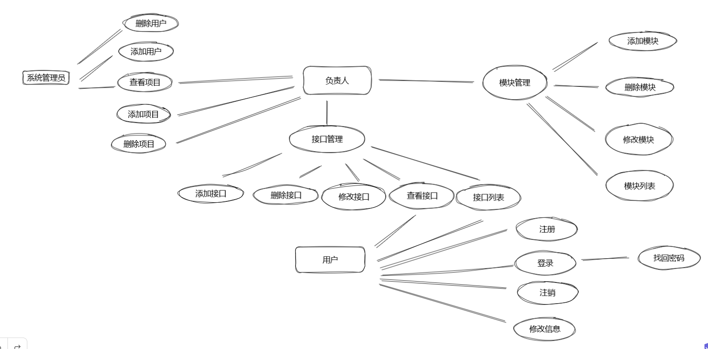

# 1，概要

```
1. 用户需求分析：了解用户需求，包括系统的功能需求和非功能需求，以及用户对于系统的期望和使用习惯等。

2. 数据库设计：设计系统的数据库结构，包括数据表的字段、关系以及数据存储方式等。

3. 前端设计：设计系统的用户交互界面，包括页面布局、风格、交互方式等。

4. 接口设计：设计系统前后端通信的API接口，包括数据传输格式、接口权限等。

5. 系统架构设计：设计系统的整体架构，包括使用技术框架、物理架构等。

6. 安全设计：考虑系统的安全性，包括防止SQL注入、XSS攻击、CSRF攻击等。

7. 性能优化设计：考虑系统的性能优化，包括缓存、压缩等。
    系统架构设计
该系统采用前后端分离的设计，前端使用 Vue3+作为开发框架，UI 组件库可以使用 element-plus 或者 Ant Design Vue；后端采用 Django 3.2 框架，并结合 Django REST framework（DRF）实现API接口的开发与权限控制等功能。MySQL 是作为系统的主要数据库，存储用户信息、题目管理、答题记录等数据。可视化BI，计时任务celery，simple-jwt验证，消息队列

    用户权限及认证管理

在系统中，用户需要注册并登录才能使用其提供的服务。因此，在前端部分，需要完成用户登录页和注册页的设计；同时，在后端中，需要将 DRF 集成到 Django 中以创建 API views 和 serializers 来管理用户的身份验证、创建新的账户、登录、重置密码等行为，并设置不同的用户角色和权限级别以限制其访问相关资源的能力。

    题目管理模块

该模块的任务是通过管理界面来对各知识点的试题进行管理，包括新建、编辑、删除、上线下线等操作。具体来说，该模块需要实现后台管理的增删改查等基础功能，如在后端应用中添加学科分类、题目难度评级、题目标签等字段，并在前端中实现它们的 CRUD 操作，供管理员进行管理。

    答题记录统计模块

该模块的任务是完成用户考试过程中的答案提交，同时支持基于时间、知识点、难度等维度的答题数据分析与统计，用于诊断学习进步情况，并给出适当的建议。具体来说，在前端部分，需要提供答卷显示和保存功能；在后端部分，需要完成 API 接口设计以解析用户提交的答案数据。

    数据存储方案

本系统选用 MySQL 作为数据库，可以通过 Django ORM 提供的方式，更方便地进行关系型数据的操作和管理。对于每个表格的创建、字段类型和索引结构可以进行优化，以满足业务场景下不同的查询需求。同时，要保证数据存储的安全性、稳定性和可靠性。在开发过程中，需要考虑数据库的备份、容灾等常规措施。
```

# 2,流程设计

## - 接口文档



## -数据表设计

```
概念模型
1，该系统目的
2，组织或人员
逻辑模型
1，分几个主题，主题包含的实体
2，实体的属性都有什么
3，实体之间的关系
4，各个实体间是否有约束关系
物理模型与实现
1，表设计，需要多少表
2，类型和长度定义，视图
3，字段和详细定义，非空。默认值等
4，枚举类型字段
5，约束的定义，主键，外键，索引
```

## -技术选型

```
后端
前端
数据存储
上线
```

# 3，项目实现

## -后端模块-项目创建

```
pycharm创建纯Python项目，用虚拟环境
conda环境
安装Django
pip isntall django==3.2
创建Django项目，创建apps文件夹
mkdir apps
django-admin startproject name .
或者Python manage.py startapp api apps/api，多APP需要先创建api文件夹
```

## - 配置数据库

```
创建数据库，Navicat，相关配置
excel表导入向导
Django项目，按照表设计，写model文件，或按照已有表反向生成
python manage.py inspectdb > models.py
Django项目配置数据库
settings文件，pymysql安装引用，
pip insatll pymysql
# 替换默认 MySQLdb 连接器为 PyMySQL 连接器
databases = {
	'default':{
		'ENGINGE':'django.db.backends.mysql'
		'NAME':
		'USER':
		'PASSWORD':
		'HOST':
		'PORT':
		
	}
}

    import pymysql
   # pymysql.version_info = (1, 4, 6, 'final', 0)
    pymysql.install_as_MySQLdb()

测试项目是否能跑，建议用manage.py,配置形参runserver 127.0.0.1:8000
```

## 答题

```
答题功能，功能如下：
1，用户点击答题按钮会出现一个问题，以及四个选项答案 。
2，用户选择答案，提交。
3，判断对错，返回结果。
4，答案正确，给出题解，答案错误，给出正确答案以及题解。


1. 数据库存储：
a. 题目数据：包括题目编号、题目内容、四个选项、正确答案等。
b. 用户数据：包括用户编号、姓名、账号、密码等。
c. 答题数据：包括答题编号、用户编号、题目编号、选项编号、答案是否正确、答题时间等。
2. 后端实现：
a. 首先从数据库中查询题目数据，随机抽取一道题目，并将题目信息返回给前端。
b. 用户选择答案后提交，后端接收答案、题目编号以及用户信息后，判断答案是否正确，将答题数据存入答题数据表中。
c. 返回结果时，后端查询答题数据表，返回答案是否正确以及相关的题解信息。
3. 前端实现：
a. 设计答题界面，包括题目、选项按钮以及提交按钮等。
b. 点击提交按钮后，前端将用户选择的答案、题目编号以及用户信息通过API接口提交给后端，并等待后端返回结果。
c. 前端接收到后端返回的结果后，展示答案是否正确，以及答案解析信息。如果答案错误，展示正确答案以及题解。
```

## 知识点学习

```
知识点学习功能，功能如下：
1，用户点击学习，会出现知识点。
2，一页只显示一个知识点和用户名，和上一个知识点标题，以及下一个标题。
3，点击下一个知识点按钮，会返回下一个知识点。
4，点击上一个知识点按钮，会出现上一个知识点，没有上一个知识点会显示首页标题。
```


## 知识点功能测试

```
先创建有知识点编号，题目，内容
用户数据表，编号，姓名，账号名，密码
后端随机返回一个id的知识点和用户姓名，保证用户和知识点正常读取
后端接口代码
1，安装DRF3.x版本，包名为djangorestframework，2.x包名为django-restframework
pip install djangorestframework
配置settings文件，注册'rest_framework'
2，序列化器,modelserializer
导包用rest_framework,导入模型
from rest_framework import serializers
from .models import 模型
class serializer(serializers.modelserializer):
	class Meta:
		model = 模型（不用加引号）
		fields = '__all__'
# 更改序列化器，只要问题
		fields = ['id', 'question']
		
3，视图,modelviewset
class modelviewset(modelviewset):
	queryset = 模型.objects.all()
	serializer_class = serializer
显示分页器
	
4,路由，routers


```


