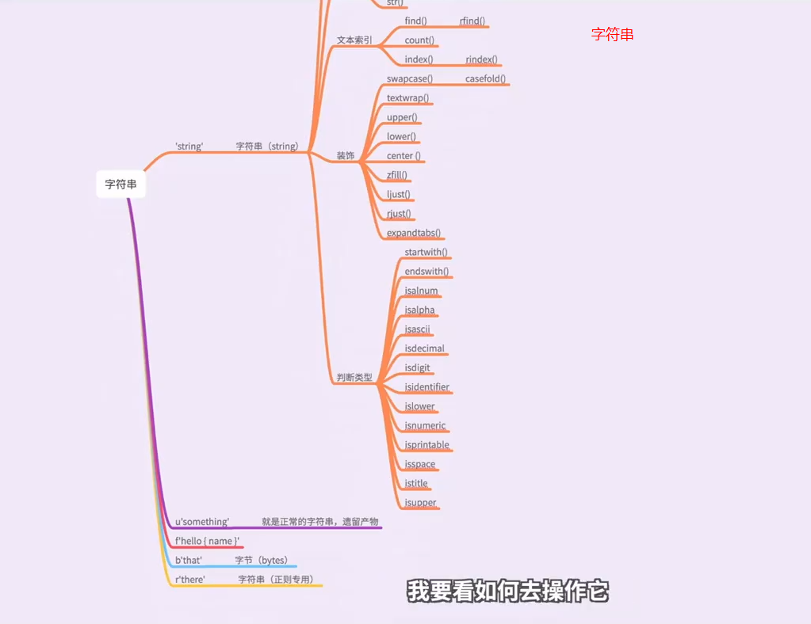
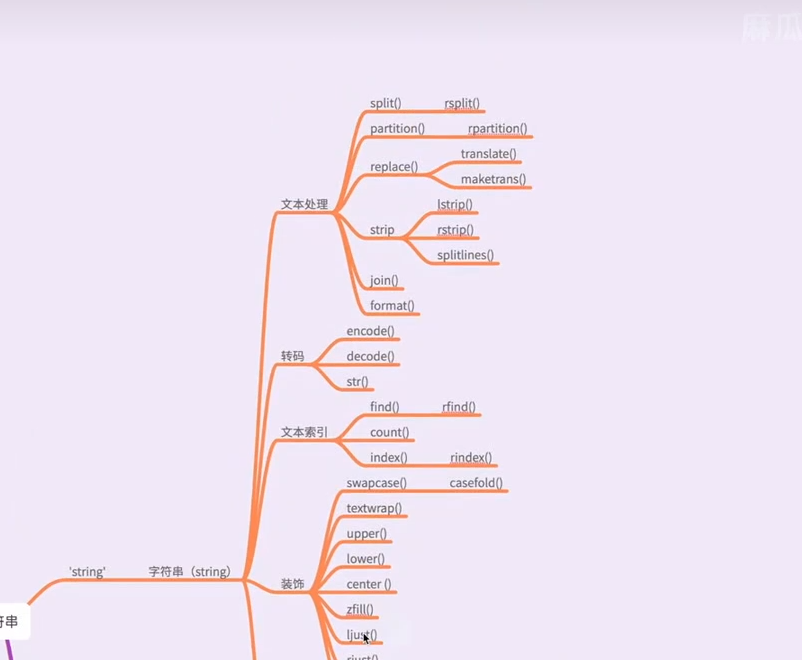

# 变量

# 数据类型：

## 一切皆对象

## 可变数据类型：列表和字典

## 不可变数据类型：字符串，数值，布尔，元组

字符串，函数dir(str)查看所有用法，双下划线为属性

布尔

## 深浅拷贝

## 推导式

# 函数与类

## 作用域

## 内置函树

# 异常处理

# Python高级

## 高级特性

- 从语法，对象，结果，特点，区别来分析

1，切片

2，迭代

3，列表生成式

4，生成器

5，迭代器

## 高阶函数

- 内置函数，从语法，参数，结果，特点，区别等方面分析

1，map

2，reduce

3，filter

4，sorted

5，zip

6，返回函数

7，匿名函数

8，偏函数

# Python原理

## Python底层实现清单

- 内存管理&垃圾回收

- 变量对象管理

- 数据类型底层实现

- - 列表
  - 元组
  - 字符串
  - 数值
  - 字典

- 类封装

## 24种设计模式

设计模式-创建型

- 创建型-01 工厂模式
- 创建型-02 抽象工厂模式
- 创建型-03 生成器模式
- 创建型-04 原型模式
- 创建型-05 单例模式
- 创建型-06 多例模式

设计模式-结构型

- 结构型-01 适配器模式
- 结构型-02 桥接模式
- 结构型-03 组合模式
- 结构型-04 装饰者模式
- 结构型-05 外观模式
- 结构型-06 亨元模式
- 结构型-07 代理模式

设计模式-行为型

- 行为型-01 责任链模式
- 行为型-02 命令模式
- 行为型-03 解释器模式
- 行为型-04 迭代器模式
- 行为型-05 中介者模式
- 行为型-06 备忘录模式
- 行为型-07 观察者模式
- 行为型-08 状态模式
- 行为型-09 策略模式
- 行为型-10 模板方法模式
- 行为型-11 访问者模式

## 七大设计原则

- 1、单一职责原则【SINGLE RESPONSIBILITY PRINCIPLE】：一个类负责一项职责.
- 2、里氏替换原则【LISKOV SUBSTITUTION PRINCIPLE】：继承与派生的规则.(子类可替换父类)
- 3、依赖倒转原则【DEPENDENCE INVERSION PRINCIPLE】：高层模块不应该依赖低层模块，二者都应该依赖其抽象；抽象不应该依赖细节；细节应该依赖抽象。即针对接口编程，不要针对实现编程。
- 4、接口隔离原则【INTERFACE SEGREGATION PRINCIPLE】：建立单一接口，不要建立庞大臃肿的接口，尽量细化接口，接口中的方法尽量少。
- 5、迪米特法则【LOW OF DEMETER】：高内聚 低耦合 – high cohesion low coupling(类只做一类事情,类的成员函数关联尽量少)
- 6、开闭原则【OPEN CLOSE PRINCIPLE】：一个软件实体如类、模块和函数应该对扩展开放，对修改关闭。
- 7、组合/聚合复用原则【Composition/Aggregation Reuse Principle(CARP) 】：尽量使用组合和聚合少使用继承的关系来达到复用的原则。
